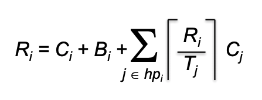

# Worse Case Response Time with Blocking

An implementation of the worse case response time algorithm that takes blocking into account. 
Useful for calculating the schedulability of a real-time stream of tasks.

## Recurrence equation:



[Source, p. 36](https://ti.tuwien.ac.at/cps/teaching/courses/real-time-systems/slides/rts07_rt_scheduling-1.pdf)

## Usage

```shell script
python3 thisScriptName.py tasksFile.txt monotonicType[rate|deadline]
```

## Examples

```shell script
python3 wcrt.py test_cases/set1_schedulable.txt deadline
```

```shell script
python3 wcrt.py test_cases/set2_schedulable.txt rate
```

```shell script
python3 wcrt.py test_cases/set3_unschedulable.txt rate
```